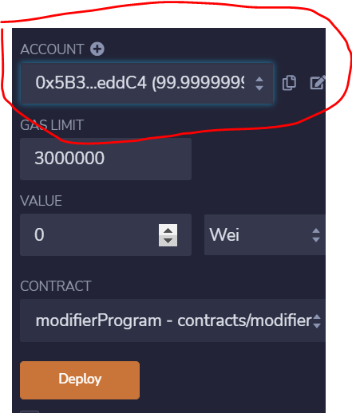
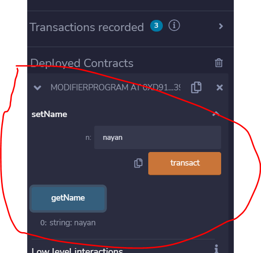
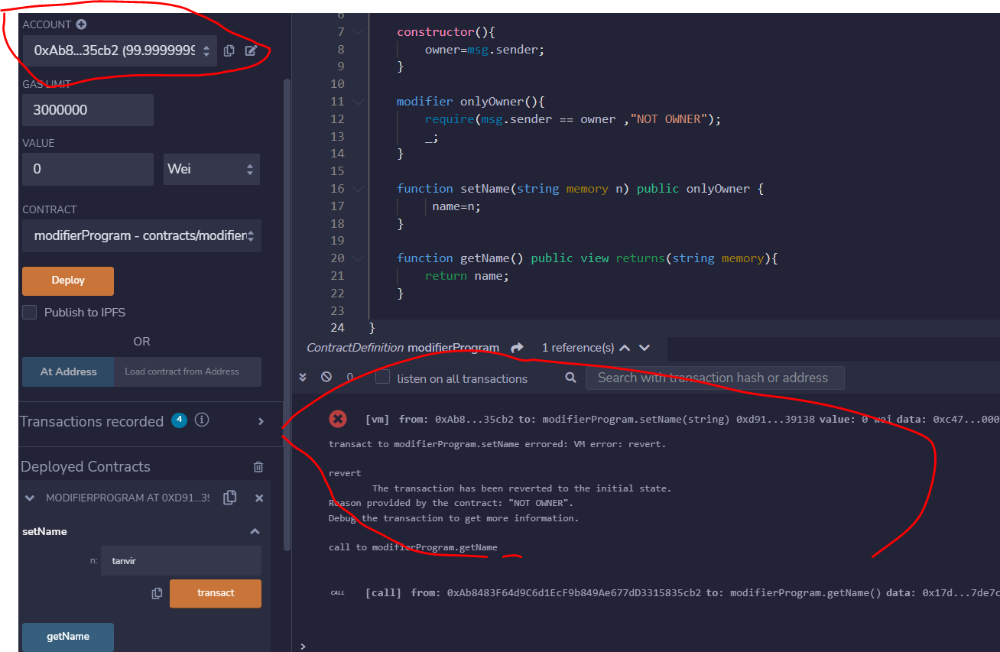

 1> 0xB53... is the address of the owner (deployed the peoject)

 2> after the inputing the string and clicking transact,the clicking the getName button will give the inputed name back.

 3> Now when some other person of address 0xAb8... who is not the owner , clicks transact a error will be pop up in terminal .

